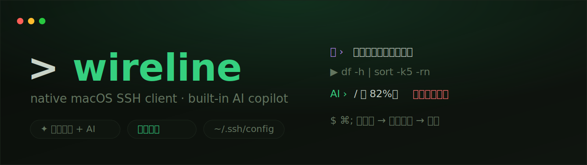

<p align="center">
  
</p>

<p align="center">
  <a href="README.md">English</a> · <b>简体中文</b>
  &nbsp;·&nbsp;
  <a href="https://github.com/almightyYantao/wireline/releases/latest">下载</a>
  &nbsp;·&nbsp;
  <a href="https://almightyyantao.github.io/wireline/">官网</a>
  &nbsp;·&nbsp;
  <a href="https://yantao.wiki">博客</a>
</p>

> 原生 macOS SSH **舰队管理器** · 绝不锁定你的数据 · AI 把批量运维变成一句话

**你的数据永远不被扣押。** 主机配置**始终以标准 `~/.ssh/config` 为唯一数据源**——图形界面只是这份标准配置之上的高效外壳。卸载 Wireline 后，`ssh` / `scp` / `rsync` / VS Code Remote 仍能直接读取同一份配置。没有私有账号、没有你退不出的云同步、也永远用不上「导出」按钮。这就是 Wireline 和那些把主机锁进自家格式的 SSH 客户端的根本区别。

**为多主机而生，不是单机。** 别名、分组、批量是一等公民:选中一整个分组，用一句话描述任务，Wireline 并发铺开到每台机器,再把所有主机的输出汇总成一个结论或一张对比表——**机器不用先连上**。纯 AI 终端做不到这件事,因为它没有你的主机图谱。

**AI 是杠杆，不是卖点。** 在这之上叠加的助手是真正能**动手**的:自然语言→命令、诊断报错、带变更评审地改远程文件、甚至帮你建隧道/加主机——全部需二次确认、发送前脱敏。

外面包着原生 macOS 的终端黑客风(等宽字体 · 绿黑配色 · 可换主题),内置真实 PTY 终端、可视化 SFTP、图形化端口转发,以及整窗动态壁纸。

## 📸 截图

<p align="center">
  <video src="https://github.com/almightyYantao/wireline/raw/main/docs/ai-demo.mp4" controls muted width="90%"></video>
</p>

<p align="center"></p>
<p align="center"></p>

---

## 🚀 舰队(Fleet)

单机 AI 终端给不了的能力:一次操作一整个分组——因为 Wireline 掌握你的主机图谱。

- **一句话，多主机**:选中若干主机或一整个分组,描述一次任务,并发跑遍全部
- **是汇总，不是刷屏**:逐机输出可折叠,顶部由 AI 提炼成一个结论或一张对比表
- **无需先连接**:非交互引擎直接跑批,不必逐台开会话
- **规模化也安全**:高危命令在触及舰队前仍强制二次确认;发送前脱敏
- **认得分组与别名**:直接用 `~/.ssh/config` 里的别名或分组名指定目标——和 `ssh` 用的是同一套名字

---

## ⚔️ Wireline vs Termius vs Warp

| | **Wireline** | Termius | Warp |
|---|---|---|---|
| 定位 | 原生 macOS SSH **舰队管理器** | 跨平台 SSH 客户端 | AI 原生终端 |
| 主机数据存在标准 `~/.ssh/config` | ✅ 唯一源 | ❌ 自家 vault | — 不管理主机 |
| 完全本地、无需账号即可用 | ✅ | ⚠️ 同步/AI 需账号 | ✅（2026 起登录可选） |
| 自带 AI endpoint / 完全本地 Ollama | ✅ 全部 AI(含舰队 agent) | ❌ 只能用其云模型、无 BYOK | ⚠️ 本地 AI 仅覆盖命令生成;agent 走云 |
| Fleet：选组 → 一句话 → 并发 → AI 汇总成表 | ✅ | ⚠️ 广播镜像输入(无汇总)或云端 chat agent | ❌ 无主机图谱 |
| 可视化 SFTP | ✅ | ✅ | ❌ |
| 图形化端口转发 | ✅ | ✅ | ❌ |
| AI 改远程文件 + 变更评审 | ✅ | ❌ | ❌ |
| 自然语言 → 命令 / 诊断 | ✅ | ✅ | ✅（最成熟） |
| 跨平台（Win/Linux/移动） | ❌ 仅 macOS | ✅ | ✅ 桌面 |

*竞品能力为 2026-07 时点信息 —— 它们迭代很快,发布前请对照最新版本核对。*

**只有 Wireline 同时做到:** 主机留在标准 `~/.ssh/config`(不锁定)、**全部** AI 功能(含舰队 agent)跑在你自己的 endpoint 或完全离线的 Ollama 上、一句话指挥整组并把输出汇总成一张表。

> Warp 加了本地 AI,却仍不管你的主机;Termius 管主机,却把它们锁进自家 vault、AI 只跑在它的云上。Wireline 把主机留在标准 `~/.ssh/config`、AI 跑在你自己的模型上(或完全离线)、一句话指挥整支舰队。

---

## 🤖 AI 助手

AI 是让上面这一切变得毫不费力的杠杆,不是外挂功能。设置 → AI 里填入 **OpenAI 兼容的服务地址 + Key**（中转站/直连），或指向本地 **Ollama**（数据不出本机）。终端右下角的 ✨ 打开 AI 面板。

- **自然语言 → 命令**：说需求，生成命令,`[插入]` 或 `[运行]`，绝不自动执行
- **命令栏 ⌘;**：说需求 → 生成命令 → 再按 ⌘; 执行
- **诊断报错 / 解释 / 总结**：一键分析终端输出、解释命令(高危警告)、总结长日志
- **Agent 自动执行**：AI 给命令 → 真实执行 → 拿输出 → 继续，直到给出结论
  - 可选**终端内执行(全程可见)**或**旁路执行**；**高危命令强制二次确认**；**只读沙盒**彻底禁写
- **舰队群跑**：多选主机 → 一句话 → 并发执行 → AI 汇总成结论/表格
- **AI 副驾**：一句话让 AI 操作客户端本身——建端口转发、加主机、连接、开文件、跑片段(均需确认)
- **SFTP 里 AI 改文件**：右键远程文件 → 说改动 → 预览 → **变更评审(影响+风险)** → 写回
- **变更评审**：危险命令执行前，AI 给出影响面与风险点再确认
- **主机记忆/画像**：AI 记住每台机器的稳定信息，之后回答自动结合，越用越懂你的环境
- **会话复盘 → Runbook**：把本次操作整理成带步骤/命令/回滚的 Markdown 手册
- **告警自动归因**：主机掉线时 AI 给出可能原因与排查建议(附在通知里)
- **上下文引用**：`@输出` / `@主机` / `@历史`（命令历史语义召回）
- **每主机独立会话历史**（持久化）、**token 用量估算**、**主/快速模型切换**、**发送前脱敏**、**存为脚本片段**

---

## 🐾 桌面宠物

打开 Wireline 就悬浮在桌面上的一只可拖动、始终置顶的小精灵 —— 它有**独立的 AI 对话窗口**（不是终端那个面板）。**⌥⌘J**(**全局热键**,在任意 App 里都能唤出,不必 Wireline 在前台;可自定义)唤出/收起,或直接点它。收起对话后键盘焦点会自动交还给终端。

- **说人话，它自己找机器**：「把 `fn` 机器在跑的 docker 容器总结下」，或「把 `IAI` 的所有机器总结下当前的 Docker 状态」——它会**按别名或按分组**解析出目标机器，用同一套非交互舰队引擎**并发执行**（**机器不用先连上**），再把结果汇总给你
- **天生多机**：一句话就能铺开到一整个分组；逐机结果可折叠，顶部是整体 AI 结论
- **安全**：高危命令在多机执行前仍强制二次确认；发送前脱敏
- **悬浮不挡事**：无边框透明、可随意拖动；对话框**向上展开**，宠物原地不动始终在鼠标下；独立持久化对话历史
- 在 **设置 → AI → 桌面宠物** 里可开关

---

## ✅ 待办

紧挨着终端的独立每日清单 —— **⌘D**(可自定义)或点菜单栏图标打开。

- **菜单栏常驻**:实时显示未完成数,快速添加、快速勾选,不用开窗
- **截止日期 + 时间**,逾期高亮,到点弹**系统通知**
- **优先级(星标)、标签、备注、子任务**(带 `已完成/总数` 进度)
- **重复任务**(每天 / 每周 / 每月)—— 完成一个自动生成下一次
- **搜索** 与 **标签筛选**;按 全部 / 未完成 / 已完成 过滤
- **全键盘操作**:↑↓ 选中、空格勾选、回车编辑、Delete 删除、**⌘Z 撤销**
- **AI 总结**(复用你配置的 AI):用自然语言给出 *今日 / 本月* 完成情况与仍需关注的重点
- **智能添加**:输入「明天下午3点交周报」,AI 自动补全标题、截止时间、优先级
- 与主窗口**共用壁纸背景**,并跟随**加密备份 / 迁移** —— 换 Mac 待办一起带走

数据只存在本机 `todos.json`(以及可选的加密备份),绝不写入 `~/.ssh/config`。

---

## ✨ 功能

**连接与管理**
- 🔍 全局快捷连接（⌥⌘K）：**系统级热键**,在任意 App 里都能激活 Wireline 并打开 Spotlight 式模糊搜索(别名/描述/分组),回车即连
- 🗂 侧栏合并主机列表：分组分区、可折叠(状态记忆)、拖拽入组、右键新建/删除分组
- 🟢 连通性探测：`在线 / 离线 / 探测中`，已连接主机显示 `已连接`；可选后台巡检 + 系统通知
- 🔑 认证自动识别：密钥 / 密码；密码交由 **macOS Keychain** 加密存储，配置文件不落明文

**内置终端**
- 🖥 真实 PTY 终端（[SwiftTerm](https://github.com/migueldeicaza/SwiftTerm)），无需外部 Terminal
- 🔐 密码主机用 OpenSSH askpass **自动填充**（复用 Keychain）；标记后可**自动 `sudo -i` 并自动输入已存密码**——密钥登录的主机也一样
- 🧩 会话标签页（带序号，双击就地重命名）；⌘1–9 切换；⌘T 开本机 shell；⌘W 关当前会话
- 🪟 **分屏**：把一个标签拖到另一个标签的面板边缘即合并成「分屏标签」；⌘[ / ⌘] 切换焦点；可把某格拆回独立标签
- 📡 **广播输入**：一次输入,同步发到所有会话
- 🔎 **终端内搜索 ⌘F**：在滚动缓冲区里搜关键字并高亮
- 🔔 **长命令完成通知**：应用在后台时,耗时命令跑完弹系统通知
- 📼 **会话日志录制**：把会话输出录到文件,一键在访达中定位
- ♻️ **会话恢复**：重启后自动重开(并重连)上次打开的标签
- 📊 状态栏实时远端 **CPU / 内存 / 时间**（经 ControlMaster 复用连接采集，不打扰终端）
- 📝 运行 vim/vi 时右上角弹**速查表**(可收起为浮窗图标)
- 🎨 内置多款配色(Dracula/Nord/Solarized/Gruvbox/Tokyo Night/One Dark)，也可导入 **iTerm2 `.itermcolors`**；字体、字号可调

**文件与运维**
- 📁 可视化 **SFTP**（[Citadel](https://github.com/orlandos-nl/Citadel)）：左远程/右本地双栏，拖拽/双击传输、新建/重命名/删除，**右键 AI 改文件**
- ⚡ 批量 / 舰队执行：多选主机并发跑同一命令、聚合输出
- 🔀 图形化端口转发（`ssh -L`，支持跳板机，一键启停）
- 🧰 命令片段库：多行命令、`{{占位符}}` 运行时弹窗填参
- 🔑 **SSH 密钥管理**：列出 `~/.ssh` 公钥及指纹、生成(ed25519/rsa/ecdsa)、从别处导入(自动修权限)、复制公钥、一键 `ssh-copy-id` 部署到主机
- 💾 加密备份与迁移：主机 + Keychain 密码导出为口令加密文件；支持**备份到 WebDAV**(仅上传密文),待办也一起带走

**原生体验与个性化**
- 🖼 整窗**壁纸**：图片或循环 **mp4**，面板半透明叠加(不可见时自动暂停解码)
- ⌨️ **可自定义快捷键**：录制式设置、冲突检测，全部动作可改键
- 🌐 中文 / English 运行时切换；隐藏标题栏融入深色 UI；自定义设置窗口

> 无服务端、无中心数据库，所有状态都在本机。

---

## 🚀 构建与运行

需要 **Xcode 26+ / Swift 6.2**（macOS 14+）。

```bash
# 生成可运行的 .app 并打开
./scripts/bundle.sh --run

# 打包分发（.dmg + .zip，ad-hoc 签名）
./scripts/package.sh

# 只跑核心逻辑单元测试
swift test
```

`bundle.sh` 会 release 构建、组装 `build/Wireline.app`（含 Info.plist + 自动生成图标），并做 ad-hoc 签名以便本机 Keychain 正常工作。也可用 Xcode 打开 `Package.swift` 直接运行（⌘R）。

### 开发热重载
- `./scripts/dev.sh`：监听 `Sources/`，改动自动重建 debug 包并重启。
- 或用 Xcode + [InjectionIII](https://github.com/johnno1962/InjectionIII/releases)（已接入 [Inject](https://github.com/krzysztofzablocki/Inject)，release 自动 no-op）。

---

## 🧱 架构

两个 SwiftPM target：

- **`WirelineCore`** — 纯 Swift 库，无 UI，可单测
  - `SSHConfig` / `ConfigRepository`：解析回写标准 `~/.ssh/config`，元数据以 `# wireline:` 注释内嵌；原子写入 + 时间戳备份 + 0600 权限
  - `KeychainService`（Security framework）· `SSHCommand` / `PortForwardManager` · `BackupService`（PBKDF2-SHA256 + AES-GCM）
- **`Wireline`** — SwiftUI 应用
  - `HostStore` / `SessionStore` / `ForwardStore` / `AIConfig` / `AIChatStore`（`@Observable`）
  - 内置终端(SwiftTerm)、SFTP(Citadel actor 隔离)、远端指标(ControlMaster)、AI 客户端(OpenAI 兼容流式)、舰队并发执行

依赖：SwiftTerm（终端）· Citadel（SFTP）· Inject（仅 debug 热重载）。

---

## 🔒 安全说明

- 密码 / AI Key 仅存于 macOS Keychain，配置文件里只保留 `auth=password` 标记。
- AI：发送前可脱敏(密码/token 打码)；生成命令**永不自动执行**；Agent 高危命令强制确认，另可开只读沙盒。
- 备份口令不落盘、不上传；丢失口令等同于备份不可恢复。
- 除你配置的 AI 服务外无任何网络回传；SSH 连接均在本机与目标服务器间直接发生。
- 写入 `~/.ssh/config` 前自动时间戳备份，并强制 0600 权限。

---

## Star 趋势

<a href="https://star-history.com/#almightyYantao/wireline&Date">
  
</a>

---

## 许可

MIT。详见 [LICENSE](LICENSE)。
